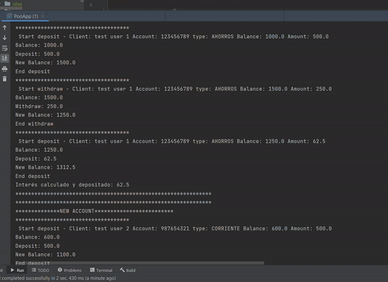

# Programming Fundamentals

### Description

Conceptos fundamentales en programacion con Java, con ejemplos prácticos enfocados a procesos
bancarios.

- Simulación de la interacción de un usuario con un sistema bancario.

## Modules

### - Basic Syntax

**Business case**

El cliente de un banco XYZ, desea realizar una operación bancaria, segun la acción seleccionada, se
procesará la operación.

- Listado de usuarios mock
- Operaciones (DEPOSIT, WITHDRAWAL, CONSULT ó OTHER)
- Montos aleatorios
- Uso de sentencias basicas (foreach, if else, case y while)

[Ver imagen 1](./assets/basicsyntax/BasicSyntaxApp_1.png)
[Ver imagen 2 ](./assets/basicsyntax/BasicSyntaxApp_2.png)


--- 

### - POO (Object Oriented Programming)

**Business case**

Un usuario desea solicitar una cuenta con el cual se le permite realizar operaciones segun el tipo
de cuenta seleccionada.

- Listado de usuarios mock
- Tipo de cuenta (AHORROS, CORRIENTE)
- Operaciones (DEPOSIT, WITHDRAWAL, CONSULT)
- Montos aleatorios

*Pilares*

**Abstracción:**

Permite presentar conceptos abstractos del mundo real, enfocandose en caracteristicas escenciales y
ocultandolo detalles innecesarios. La abstracción se manifiesta o tiene como resultado, definir
estructura o compartamientos en clases e interface.

- **Clases**: Es un molde o plantilla que define propiedades o comportamientos comunes del objeto.
- **Objeto**: Es una instancia de una clase, Es la unidad básica de la POO, que tiene atributos (
  datos) y métodos (comportamientos). Los objetos interactúan entre sí a través de sus métodos.

> En una aplicación de banco, un "Cliente" y sus "Cuentas" pueden ser objetos con atributos como nombre, número de cuenta y saldo, y métodos como depositar() o retirar().

```java

public class BankAccount {
  private String number;
  private TypeAccount type;
  private double balance;
  private String clientName;
  
  public void deposit(double amount);

  public void withdraw(double amount);
}

```


**Encapsulamiento:**

Consiste en restringir el acceso a los detalles internos del objeto y exponer solo lo necesario. Se logra con los modificadores de acceso (private, public, protected).

- **private**: Restringe el acceso de la clase, método o atributo solo a la misma clase en la que se define. No es accesible desde otras clases, ni siquiera las del mismo paquete. Es el nivel de acceso más restrictivo.
- **public**: Permite que la clase, método o atributo sea accesible desde cualquier parte del programa, sin restricciones. Es el nivel de acceso más permisivo.
- **protected**: Permite el acceso a la clase, método o atributo desde clases del mismo paquete y desde subclases (incluso si están en diferentes paquetes). Se utiliza principalmente para permitir la herencia controlada.
- **default**: Cuando no se especifica un modificador de acceso, se aplica el acceso por defecto (también conocido como acceso de paquete o package-private). El miembro de la clase es accesible solo desde otras clases del mismo paquete, pero no desde subclases en diferentes paquetes.

Resumen de Modificadores de Acceso en Java

| Modificador   | Clase | Paquete | Subclase | Mundo |
|---------------|:-----:|:-------:|:--------:|:-----:|
| `public`      | ✔     | ✔       | ✔        | ✔     |
| `protected`   | ✔     | ✔       | ✔        | ✘     |
| `default`     | ✔     | ✔       | ✘        | ✘     |
| `private`     | ✔     | ✘       | ✘        | ✘     |

- ✔ = Acceso permitido
- ✘ = Acceso no permitido

---
**Herencia:**

Se pueden crear clases derivadas que heredan características de una clase base.

> En una aplicación de banco, puedes tener una cuenta de ahorros y una cuenta corriente, pero ambas pueden heredar de una clase generica como CuentaBancaria, ademas puedes añadir caracteristicas especificas por cada tipo de cuenta.

```java

public class BankAccount {
  private String number;
  private TypeAccount type;
  private double balance;
  private String clientName;
  
  public void deposit(double amount);

  public void withdraw(double amount);
}


public class CurrentAccount extends BankAccount{

  private double overdraftFeePercentage;

  public CurrentAccount(String number, TypeAccount type, double balance, String clientName,
      double overdraftFeePercentage) {
    super(number, type, balance, clientName);
    this.overdraftFeePercentage = overdraftFeePercentage;
  }
}
```

**Polimorfismo:**

Permite que una misma interfaz o método se comporte de diferentes maneras según el objeto que lo esté utilizando. Esencialmente, significa "muchas formas" y proporciona flexibilidad en el diseño del software, permitiendo tratar diferentes tipos de datos de manera uniforme.


- **Polimorfismo de Método**: Este tipo se refiere a la capacidad de un método para tomar diferentes formas. Se puede lograr a través de:
  * *sobrecarga de métodos:*  donde múltiples métodos pueden tener el mismo nombre pero diferentes parámetros.
  * *sobreescritura de métodos:* donde un método en una clase hija tiene una implementación diferente que el mismo método en la clase padre.
- **Polimorfismo de Subtipo**: Este tipo se refiere a la capacidad de un objeto de una clase derivada de ser tratado como un objeto de su clase base. Esto permite que se utilicen referencias de la clase base para referirse a objetos de clases derivadas, facilitando la reutilización de código y la flexibilidad en el diseño del software.


> En una aplicación bancaria, los cálculos y comisiones varían según el tipo de cuenta. Por ejemplo, en una cuenta corriente, no se consideran los límites de transacciones como en una cuenta de ahorro, pero puede haber penalidades por retirar un exceso de dinero. Por otro lado, en una cuenta de ahorro, se obtiene un porcentaje de interés por mantener el dinero depositado, y se aplican límites en la cantidad de retiros permitidos sin penalización. En resumen, cada tipo de cuenta tiene una forma específica de calcular y manejar transacciones, adaptada a sus características particulares.

```java
public interface TransactionService {

  void deposit(double amount);

  void withdraw(double amount);

}

public class BankAccount {
  private String number;
  private TypeAccount type;
  private double balance;
  private String clientName;
}

```

```java

public class CurrentAccount extends BankAccount implements TransactionService {

  private double overdraftFeePercentage;

  @Override
  public void withdraw(double amount) {
    if (this.getBalance() >= amount) {
      this.setBalance(this.getBalance() - amount);
    } else {
      double overdraftFee = (amount - this.getBalance()) * (this.overdraftFeePercentage / 100);
      amount = amount + overdraftFee;
      this.setBalance(this.getBalance() - amount);
    }
  }
}

public class SavingAccount extends BankAccount implements TransactionService {

  private double interestRatePercentage;

  @Override
  public void withdraw(double amount) {
    int counter = Constants.trxCounter();
    if (Constants.LIMIT_WITHDRAWAL_MONTH < counter) {
      amount = amount + Constants.ADDITIONAL_TRX_FEE;
    }
    if (this.getBalance() >= amount) {
      this.setBalance(this.getBalance() - amount);
    } else {
      System.out.println("Insufficient balance in your account");
    }
    System.out.println("End withdraw");
  }

}
```


---